# plan-docs

`plan-docs` 是一个项目规划技能：先把模糊想法讨论清楚，再生成可追踪、可审查、可分工、可直接执行的文档树。



> 先对齐需求，再开始实现。让每项工作都知道为什么做、由谁做、做到什么程度。

## 核心能力

- 逐字留存用户原话，避免 AI 在整理过程中改变需求；
- 通过产品经理式访谈消除歧义，明确范围、优先级和验收标准；
- 生成产品、交互、架构、接口、数据、测试和任务文档树；
- 为 Claude、Codex、CCB、OpenCode 或单 AI CLI 分配可验证的任务；
- 在执行前完成独立审查，并用 Git 检查点和护栏防止偏离；
- 支持新项目规划，也支持老项目的非破坏性逆向初始化。

## 快速开始

### 安装到 Claude Code

```bash
git clone https://github.com/2270525352/plan-docs.git ~/.claude/skills/plan-docs
```

### 安装到 Codex

```bash
git clone https://github.com/2270525352/plan-docs.git ~/.codex/skills/plan-docs
```

### 发起一次规划

```text
用 plan-docs 帮我规划一个面向设计团队的素材审批系统。
先和我讨论需求，不要写代码。
```

技能会先确认项目目标、执行环境和协作方式，再逐步建立规划文档。

## 生成内容

```text
AGENTS.md
CURRENT_STATE.md
docs/plan-docs/
  00-source/         用户原话与事实
  01-requirements/   需求与追踪
  02-architecture/   架构与接口
  03-product/        产品、交互、数据与测试
  04-tasks/          总任务与各 AI 任务
  05-execution/      当前任务与执行反馈
  06-reviews/        独立审查与门禁
  07-goals/          执行提示词
  08-automation/     自动审查
  09-git/            Git 纪律
  10-guards/         防偏离护栏
```

需求、任务、测试、审查和 Git 提交通过稳定编号互相引用，形成完整追踪链。

## 手动初始化

通常由技能自动完成。需要手动初始化目标项目时运行：

```bash
python3 <技能目录>/scripts/plan-docs-bootstrap.py install --project <项目目录> --init-tree
```

已有文件、未提交改动、Git 钩子和项目配置不会被直接覆盖。

## 可选网页项目看板

需要直观看到当前阶段、阻塞项和下一步时，可以单独运行：

```bash
npx plan-docs-dashboard --project <项目目录>
```

看板只监听本机并只读项目状态。不需要看板时，技能不会检查 Node、运行 npm 或写入任何网页依赖。

查看[项目看板仓库](https://github.com/2270525352/plan-docs-dashboard)或[读取协议与安全边界](references/08-Web项目看板.md)。

## 详细规则

- [完整技能流程](SKILL.md)
- [规划与阶段门禁](references/01-规划工作流.md)
- [文档体系与追踪](references/02-文档体系与追踪.md)
- [多 AI 分工与执行](references/03-多AI分工与执行.md)
- [独立审查](references/04-六代理审查.md)
- [Git、自动化与护栏](references/05-提示词自动化与Git.md)
- [老项目兼容迁移](references/06-老项目与兼容迁移.md)

## 开发验证

```bash
python3 -m unittest discover -s tests -v
python3 scripts/check-markdown-links.py .
```

## 许可证

[MIT](LICENSE)
