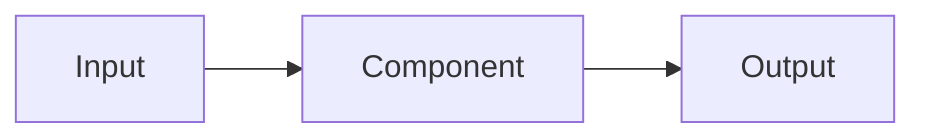

# 总体架构

## System boundary

source_user_words: []

requirement_ids: []

in_scope:

out_of_scope:

## Components

| component_id | responsibility | inputs | outputs | product_refs | requirement_ids | owner | dependencies |
|---|---|---|---|---|---|---|---|
| CMP-001 | | | | | | | |

## Data flow

## Decisions

### ADR-001

decision_id: ADR-001

source_user_words: []

requirement_ids: []

decision:

alternatives:

rationale:

constraints:

failure_and_recovery:

observability:

migration_and_rollback:

status: draft / confirmed / superseded
