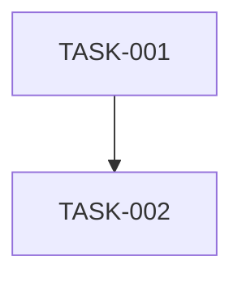

# 任务依赖与并行计划

## Dependency graph

## Schedule

| task_id | owner | dependencies | input_contracts | output_contracts | allowed_scope | write_lock | shared_interfaces | parallel_group | merge_order | conflict_resolution |
|---|---|---|---|---|---|---|---|---|---|---|
| TASK-001 | | | | | | | | | | |

## Parallel safety gate

| task_pair | files_non_overlapping | interfaces_non_overlapping | dependencies_met | io_contract_matches | locks_unique | merge_authority_named | verdict |
|---|---|---|---|---|---|---|---|
| | TODO | TODO | TODO | TODO | TODO | TODO | BLOCKED |
